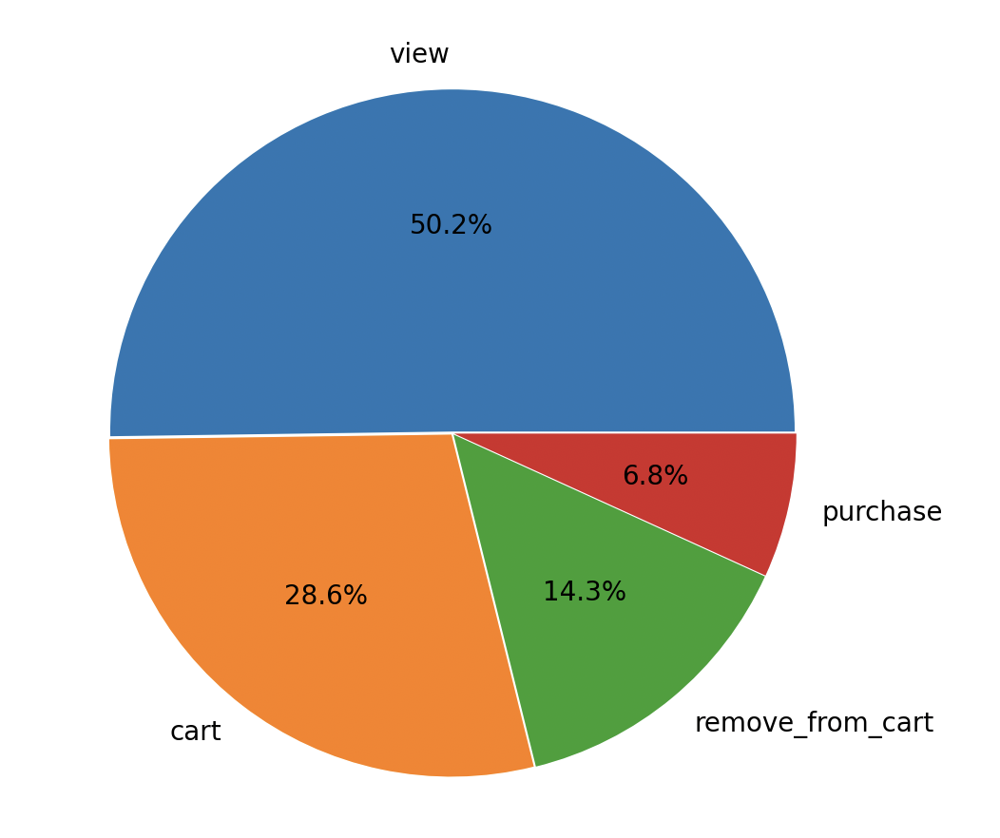
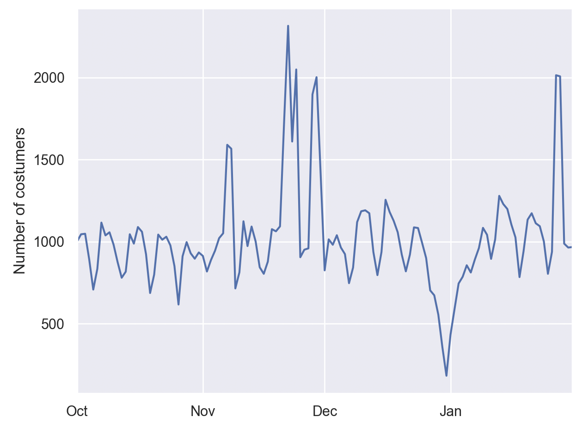
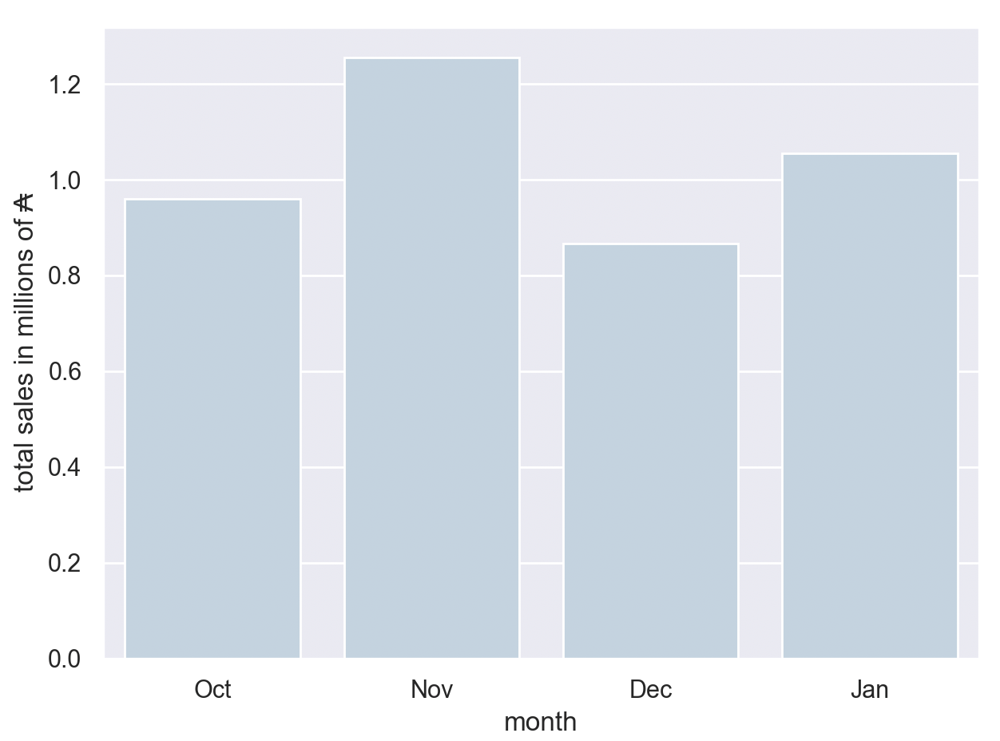
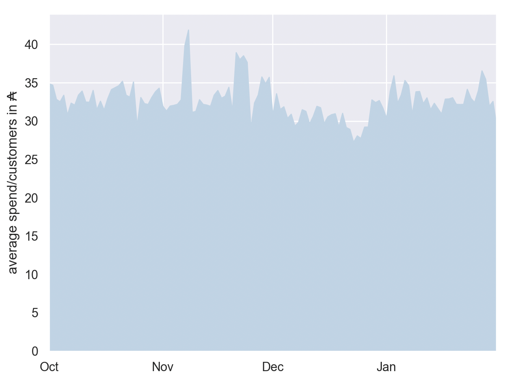
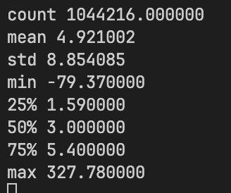
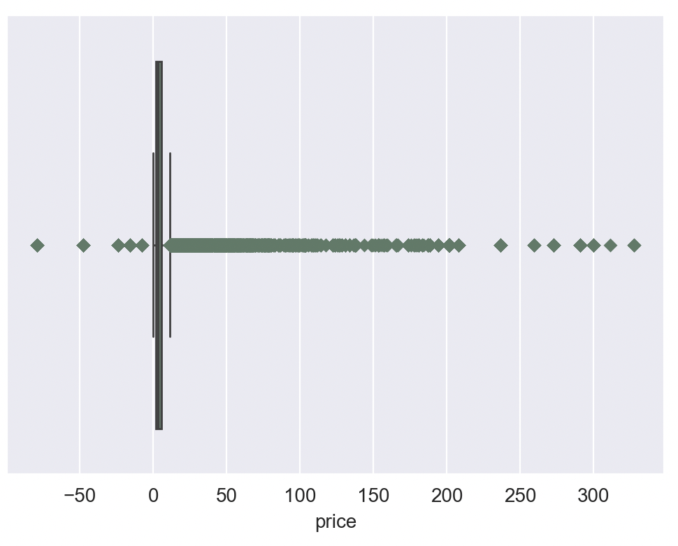
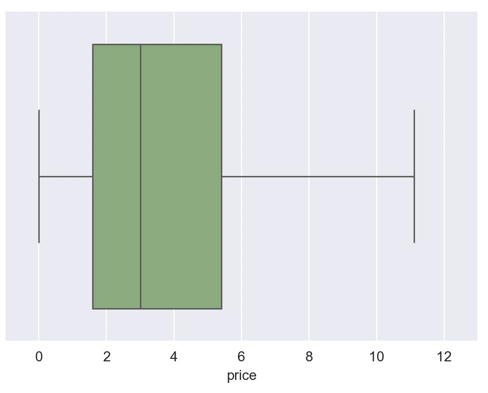
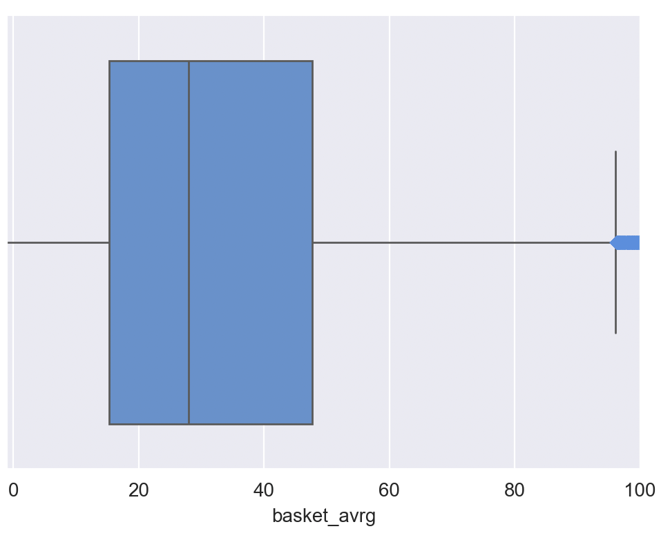

# Data Science Piscine - Documentation

# Data Engineer
## EX0: Environment Setup

To get the environment up and running, use the following command:

```bash
docker compose up -d
```

### Docker compose
The ex00 docker compose file includes an environmental variable to enforce password:
* **POSTGRES_INITDB_ARGS**: "--auth=md5 --auth-local=md5"


### Configuration (.env)
You must create a `.env` file in the root directory with the following variables:

* **POSTGRES_USER**: Your student login.
* **POSTGRES_DB**: `piscineds`
* **POSTGRES_PASSWORD**: `mysecretpassword`
* **EMAIL**: Your email address.

---

## EX1: PSQL & pgAdmin

### 1. Connect via PSQL
Run the following command to connect to the database from your terminal:

```bash
docker exec -it postgres psql -U student_login -d piscineds -h localhost -W
```

> **Note:** While `-W` prompts for a password, it may not be required as the user is considered "safe" within the container environment.

### 2. Connect via pgAdmin
Access the pgAdmin interface at [http://localhost:8080/](http://localhost:8080/) and register a new server with these details:

* **Host name/address**: Use the container IP (typically `172.18.0.2` or `172.18.0.3`).
    * *To find the IP:* `docker inspect -f '{{range .NetworkSettings.Networks}}{{.IPAddress}}{{end}}' postgres`
* **Port**: `5432`
* **Maintenance database**: `postgres`
* **Username**: `POSTGRES_USER`
* **Password**: `PGADMIN_PASSWORD`

---

## EX2: Docker & Manual Table Creation

### File Management
**Copy a folder from Host to Container:**
```bash
docker cp ./customer postgres:/tmp/customer
```

**Access the container shell:**
```bash
docker exec -it postgres sh
```

### Creating Tables Manually
1.  **Directly from Host to PSQL:**
    ```bash
    docker exec -i -e PGPASSWORD='password' postgres psql -U login_name -d piscineds < table.sql
    ```

2.  **Inside the Container:**
    ```bash
    psql -U login_name -d piscineds -f /tmp/customer/table.sql
    ```
    *inside the psql interactive shell:*
    ```sql
    \i /tmp/customer/table.sql
    ```

**View Tables in pgAdmin:**
Navigate to: `Servers` -> `ServerName` -> `Databases` -> `Schemas` -> `Tables`

---

## EX3 - EX4: Automated Table Management

### Data Loading
1. Unzip your data files and ensure the contents are moved to the root project folder.
2. Run the automation script:
   ```bash
   python3 automatic_table.py
   ```

**Bulk Import via PSQL:**
```sql
\copy data_2022_oct(event_time, event_type, product_id, price, user_id, user_session) FROM '/tmp/data_2022_oct.csv' DELIMITER ',' CSV HEADER;
```

### Table Merging (UNION ALL)
To merge multiple tables into a single final table:
```python
union_query = f"""
CREATE TABLE "{final_name}" AS
{" UNION ALL ".join([f'SELECT * FROM "{table}"' for table in table_names])};
"""
```

### Validation
To confirm the number of rows in your customers table:
```sql
SELECT COUNT(*) FROM customers; -- Expected: 20,692,840
```
#  Piscine datascience 1 - Data Warehouse
## Exercice 00: create tables
Successfully copied 380MB to postgres:/tmp/data_2023_feb.csv:
    ```docker cp ./data_2023_feb.csv postgres:/tmp/data_2023_feb.csv```
    ```docker exec -it postgres psql -U your_login -d piscineds -W```
    ```CREATE TABLE data_2023_feb (
        event_time TIMESTAMP,
        event_type VARCHAR,
        product_id INT,
        price FLOAT,
        user_id INT,
        user_session UUID
    );

    \copy data_2023_feb(event_time, event_type, product_id, price, user_id, user_session)
    FROM '/tmp/data_2023_feb.csv' DELIMITER ',' CSV HEADER;
```
## Exercice 01: customers table
The script connects to a PostgreSQL database, scans the schema for any tables starting with the prefix data_20 (representing different months like data_2022_oct, data_2023_jan, etc.), and uses a SQL command to merge them all into one master table named customers.
```sql
union_query = f"""
    CREATE TABLE "{final_table_name}" AS
    {" UNION ALL ".join([f'SELECT * FROM "{table}"' for table in table_list])};
"""
```
### Merging tables into costumers table
    INSERT INTO customers
    SELECT * FROM data_2023_feb;

**Count: 16536158**
---

## Exercice 02: remove duplicates
This script performs data cleaning operation. It uses a temporary table and identifies and removes duplicate entries in the customers table based on specific event criteria, then replaces the original table with the cleaned version.
```sql
-- first try
LAG(event_time) OVER (
    PARTITION BY event_type, product_id, price, user_id, user_session
    ORDER BY event_time
) AS prev_time
-- second try
SELECT DISTINCT 
    event_time, 
    event_type, 
    product_id, 
    price, 
    user_id, 
    user_session 
FROM {table_name};
```
**Count: 15337305** (with only LAG) ✔️
**Count: 15667350** (with only DISTINCT) 

*** Later I discovered that I should have removed 'user_session' from the "LAG(...) PARTITION BY (...)" because it causes errors in the DS2 ex01 


### Test
```sql
-- Test 1 — No exact duplicates remain:
SELECT event_type, price, event_time, user_id, product_id, user_session, COUNT(*)
FROM customers
GROUP BY event_type, price, event_time, user_id, product_id, user_session
HAVING COUNT(*) > 1;
-- Must return 0 rows
-- Test 2 — No near-duplicates within 1 second remain:
SELECT a.event_time, a.event_type, a.product_id, a.user_id
FROM customers a
JOIN customers b
  ON  a.event_type    = b.event_type
  AND a.product_id    = b.product_id
  AND a.user_id       = b.user_id
  AND a.user_session  = b.user_session
  AND a.event_time    < b.event_time
  AND EXTRACT(EPOCH FROM (b.event_time - a.event_time)) <= 1;
-- Must return 0 rows
-- Test 3 - From evaluation sheet
  SELECT * FROM public.customers
  WHERE product_id = 5802443 AND event_type = 'remove_from_cart'
  ORDER BY event_time ASC;
```
---
## Exercice 03: fusion
This script performs a fusion of two tables adding new columns and values to the first table
based on product_id.
```sql
    LEFT JOIN {table_items}
    ON {table_customers}.product_id = {table_items}.product_id;
```
**Count: 15331407** (same as the previous exercise)
---


# Piscine datascience 2 - Data Viz
## Ex00
This script creates a pie chart of the actions costumers take on the site.
```sql
    SELECT event_type, COUNT(*) AS total
    FROM customers
    GROUP BY event_type
    ORDER BY total DESC
```
# Query: We count the total number of occurencies for each event_type in the customers table.

``` text
    fig, ax = plt.subplots() 
    ax.pie(
        # The values to be plotted, labels, show percentage explode parameter...
    )
```


## Ex01
This script creates a line chart showing the number of events per day for each event type.
```sql
    SELECT event_time::date AS date, event_type, COUNT(*) AS total
    FROM customers
    GROUP BY date, event_type
    ORDER BY date ASC
```
 # Query: groups the events by date and event type, counting the total number of events for each combination. The results are ordered by date in ascending order.


```python
    fig, ax = plt.subplots()
    for event_type in df['event_type'].unique():
        subset = df[df['event_type'] == event_type]
        ax.plot(subset['date'], subset['total'], label=event_type)
    ax.set_xlabel('Date')
    ax.set_ylabel('Total Events')
    ax.set_title('Total Events per Day by Event Type')
    ax.legend()
    plt.xticks(rotation=45)
    plt.tight_layout()
```
# Number of costumers

# Number of sales

# Average spending costumer


## ex02
The script prints the mean, median, min, max, first, second and third quartile of the price of
the items purchased and displays them as box plots with the price of the items purchased.
```sql
    SELECT price
    FROM customers
    WHERE event_type = 'purchase'
```
```python
    fig, ax = plt.subplots()
    ax.boxplot(df['price'], vert=False)
    ax.set_title('Box Plot of Purchase Prices')
    ax.set_xlabel('Price')
    plt.tight_layout()
```
### Print statistics

### Price box plot of the items purchased

### Price box plot of the items purchased without outliers

###  Box plot with the average basket price per user


## Useful Docker Commands

**Stop all running containers:**
```bash
docker stop $(docker ps -a -q)
```

**Remove all containers:**
```bash
docker rm $(docker ps -a -q)
```

**Remove container and volumes:**
```bash
docker compose down -v
```

---

## Resources

* [PostgreSQL + pgAdmin + Docker Guide](https://medium.com/@marvinjungre/get-postgresql-and-pgadmin-4-up-and-running-with-docker-4a8d81048aea)
* [Connecting PostgreSQL with Python](https://neon.com/postgresql/postgresql-python/connect)
* [Python OS Library Snippets](https://www.pythonforbeginners.com/code-snippets-source-code/python-os-listdir-and-endswith)
* [Importing Data to Pandas DataFrames](https://medium.com/@alestamm/importing-data-from-a-postgresql-database-to-a-pandas-dataframe-5f4bffcd8bb2)
* [Pandas: Drop Duplicates Documentation](https://pandas.pydata.org/docs/reference/api/pandas.DataFrame.drop_duplicates.html)
* https://github.com/VulpesDev/DataPiscineNotebook/blob/main/src/DataAnalyst.ipynb